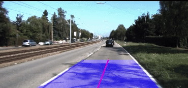
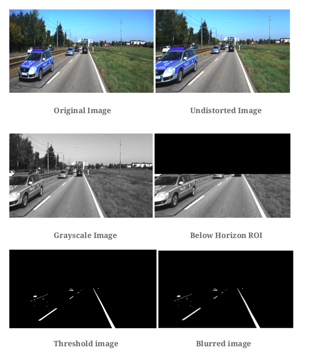
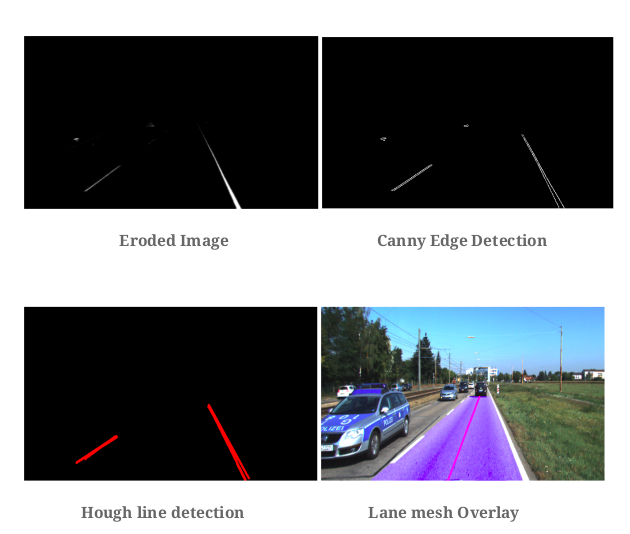
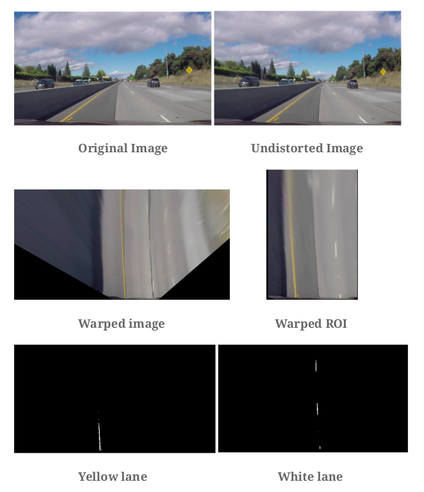
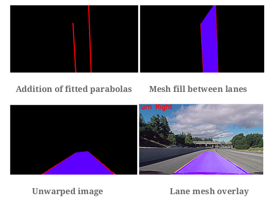

# Lane_Detection
In this project we aim to do simple Lane Detection to mimic Lane Departure
Warning systems used in Self Driving Cars. We are provided with two video
sequences, taken from a self-driving car. Our task will be to design an
algorithm to detect lanes on the road, as well as estimate the road curvature
to predict car turns. For detailed report on the project checkout [this link](https://github.com/savnani5/Lane_Detection/blob/main/Documentation/ENPM673-%20PROJ2.pdf).

## Input

[Input Data](https://drive.google.com/drive/folders/1r7ys7pS1fXXc7j13srBmU1pmoKM9wfr7?usp=sharing)

## Output

[Output Data](https://drive.google.com/drive/folders/1WzawWiSORhTyJsOCJmoqT7XxZU8T_e9s?usp=sharing)

## Pipeline

### Dataset1



### Methodology
● We are given the camera matrix and the distortion coefficients, we will use
them to undistort the image and further we will use the resultant ROI to
crop the image to remove the black padding due to undistortion.

● Then, we will convert the image to grayscale and narrow the roi below the
horizon.

● Further we will apply aggressive thresholding(>230) to select white pixels
from the frame.

● Next, we will apply gaussian blur and erosion with a 5*5 kernel to remove
the excess noise generated by surrounding objects in the image other than
the lanes.

● In this step we will use canny edge detection to detect the images.

● As a general rule we will apply probabilistic hough transform to find lines
in the canny edge detection result with parameters (rho=4, theta=np.pi/180,
threshold=30, minLineLength=20, maxLineGap=180).● As, we know hough lines algorithm outputs multiple lines for an edge, so
we have select the most prominent lines from them. We will use the line
selection function to choose the 2 most prominent lane lines.

● As the video is subject to background noise, it is possible that the lanes are
not detected in some frames and this may result in jitteriness in the lane
detection algorithm, to counter this we use a moving average function of
the lane points to smooth out the jittery results.

● Next, we call the turn prediction function to detect the upcoming turn
based on the slope of the centre line.

● Finally, we fill the lane mesh using the lane points and cv2.fillpoly function
on a new image and we do bitwise_or operation to get the transparent lane
effect on the final image.





### Dataset2


### Methodology
● We are given the camera matrix and the distortion coefficients, we will use
them to undistort the image and further we will use the resultant ROI to
crop the image to remove the black padding due to undistortion.

● Next, we warp the image to see the bird’s eye view and we narrow the
image to remove the vignette.

● Further, we create a mask of hsv values to detect the yellow line in the
warped image. The lower and upper hsv values will be [20,100,100] and
[30,255,255] to separate the yellow colour. Also, we apply a threshold to
convert the yellow values to white.

● Next, we apply an aggressive threshold on the warped image to get the
white lane.

● After this we combine the yellow and white threshold images using
bitwise_or operator.

● After this, we apply gaussian blur to remove any noise that might have
creeped in the lane detection pipeline.

● Next step is polynomial fitting to the lane curves. For this step we take
individual threshold images of the yellow and white images and use
np.argwhere(thresh == 255) to find the white pixels in the image.

● We feed these pixel locations into the standard least square function and fit
a parabola to them to get the equation constants.

● Next we generate x values using np.linspace() and corresponding y values
using the parabola constants.

● We feed these values in the trapezium_coordinates function to get the
max_x, max_y and min_x, min_y values, we use this to correct the fittedparabola. We also fill the gap in the curve if the lanes are not touching the
y extremes in the image.

● Furthermore we do a similar process with yellow pixels.

● Finally, we fill the lane mesh using the lane points and cv2.fillpoly function
on a new image.

● We use these lane lines to call the turn prediction function to detect the
upcoming turn based on the slope of the centre line.

● Next, we unwarp the image to its original perspective using the H_inverse
matrix.

● At last we perform bitwise_or between this image and the original image to
get a transparent lane mesh and we apply a sharpen filter to sharpen the
smoothening done by moving the average filter.






## How to Run the code
1) Change the directory for the first dataset in the **data_set1.py** file.
2) Run the below command to run the lane detection system on dataset1:

    ```python data_set1.py```
    
3) Change the directory for the second dataset in the **data_set2.py** file.\
4) Run the below command to run the lane detection system on dataset2:
    
    ```python data_set2.py```

## References
1) https://medium.com/@SunEdition/lane-detection-and-turn-prediction-algorithm-for-autonomous-vehicles-6423f77dc841
2) https://opencv-python-tutroals.readthedocs.io/en/latest/py_tutorials/py_imgproc/py_histograms/py_table_of_contents_histograms/py_table_of_contents_histograms.html
3) https://www.geogebra.org/?lang=en
4) https://medium.com/@galen.ballew/opencv-lanedetection-419361364fc0
5) https://opencv-python-tutroals.readthedocs.io/en/latest/py_tutorials/py_imgproc/py_houghlines/py_houghlines.html
6) https://docs.opencv.org/master/d1/de0/tutorial_py_feature_homography.html
7) https://stackoverflow.com/questions/11270250/what-does-the-python-interface-to-opencv2-fillpoly-want-as-input
8) ENPM 673, Robotics Perception - Theory behind Homography Estimation

